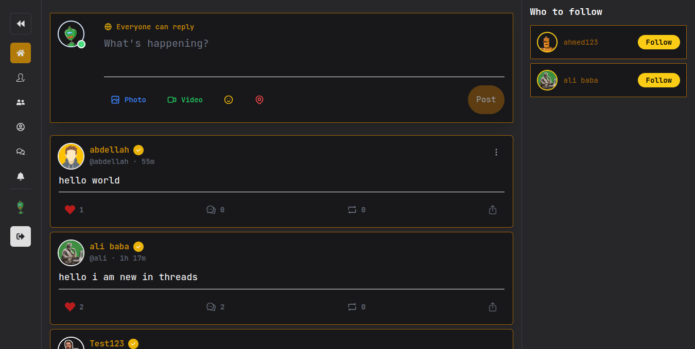

<div align="center">


<h1>Chill 🧵 Threads</h1>

<p>Share ✍️ | Like ❤️ | Comment 💬 | Follow 🔔</p>

<p>⭐⭐⭐⭐⭐</p>

</div>
<br/><br/>


<ul>
  <li>Share, edit, and delete posts.</li>
  <li>Like and comment on posts.</li>
  <li>Create a profile with a picture, cover, bio, and username.</li>
  <li>See followers, following, notifications, and your posts.</li>
  <li>Log in and out with strong authentication.</li>
  <li>Recover your account if you forget your password.</li>
  <li>And more...</li>
  <li>
    <strong><a href="https://threads-alpha-five.vercel.app/" target="_blank">LIVE DEMO</a></strong><br>
    <small>Email:</small> <code>test123@gmail.com</code> &nbsp; <small>Password:</small> <code>Test1234</code>
  </li>
</ul>


### Screenshots:

#### 🏠 Home  


#### 🔐 Login  


#### 🪐 Space  
  


#### 👤 Profile  


#### 📝 Posts  


#### 👣 Followers  


#### ➕ Following  


#### 🔔 Notifications  


### Getting Started

#### Requirements
- Node.js installed
- `npm` to install packages

#### 1. Install Packages & Set Up `.env`
Create `.env` files in both `frontend` and `backend` folders.

**Frontend `.env`:**

```env
VITE_API_URL="http://127.0.0.1:3000"
# For google authentification
VITE_CLIENT_SECRET=YOUR_GOOGLE_SECRET
VITE_CLIENT_ID=YOUR_GOOGLE_CLIENT_ID
```

**Backend `.env`:**

```env
PORT=3000
SECRET_KEY=YOUR_SECRET_KEY
DB_URL=YOUR_DB_URL (ex: mongodb://127.0.0.1:27017/threads)
NODE_ENV=development

# Cloudinary service (for storing images)
CLOUDINARY_CLOUD=YOUR_CLOUD_NAME
CLOUDINARY_API_KEY=YOUR_API_KEY
CLOUDINARY_API_SECRET=YOUR_SECRET_KEY

# Nodemailer (for sending password recovery emails)
EMAIL_USER=YOUR_EMAIL_FOR_SENDING
EMAIL_PASS=YOUR_APP_PASSWORD
```

#### 2. Run the Project

``` bash
cd frontend && npm run dev
cd ../backend && nodemon server.js
```

Open <a href="http://localhost:3000">http://localhost:3000</a> in your browser to see the result.


### Contribution
All contributions are welcome!  
Your feedback means a lot to me.


**made with ❤️ by <a href="https://www.linkedin.com/in/abdellah-karani-965928294/">AbdellahKarani</a>**


<p align="right">
<a href="https://buymeacoffee.com/alibabattym" target="_blank"></a>

